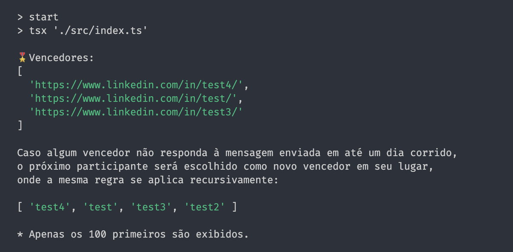

> [!IMPORTANT]
> 🇧🇷 Esse repositório é um template que te permite realizar sorteios de forma totalmente transparente através do **GitHub Actions** e é pré-configurado para sortear perfis do **LinkedIn** através do **Google Sheets**.
>
> Crie seu clone ou _fork_ e edite conforme sua necessidade, sempre respeitando a [licença do template original](https://github.com/wellwelwel/google-sheets-giveaway-template/blob/main/LICENSE).
>
> <pre>
> 🇺🇸 This repository is a template that allows you to run giveaway completely transparently via GitHub Actions and is pre-configured to sweep LinkedIn profiles via Google Sheets.
> 
> Create your clone or fork and edit according to your needs, always respecting the license of the original template.
> </pre>

## Exemplo de Sorteio _(Giveaway Example)_

## Template de Chamada _(Call Template)_

<blockquote>

<pre>🇺🇸 Below is a suggested call in Portuguese only.</pre>

## Quer ganhar gratuitamente o \_\_\_? 🙌

🎖️ \_\_\_ perfis do LinkedIn serão sorteados para ganhar o \_\_\_ de forma completamente gratuita.

### ⚠️ IMPORTANTE <!-- Remova caso você tenha autoria sobre o prêmio -->

- O sorteio é realizado de forma totalmente independente pelo autor, não tendo NENHUMA relação com o \_\_\_.

---

### 🧑‍⚖️ REGRAS

- Apenas perfis válidos de usuários do LinkedIn serão aceitos (páginas e similares não serão aceitos, assim como outros links ou redes sociais).
- Envie seu perfil apenas uma vez.
- É necessário que o envio de mensagens no LinkedIn esteja aberto para o público ou que o usuário tenha se conectado com o autor do sorteio para que o contato seja possível, caso contrário, será selecionado outro vencedor no lugar.
- Caso algum vencedor não responda à mensagem enviada em até um dia corrido ou não seja possível o contato via LinkedIn, o próximo participante será escolhido como novo vencedor em seu lugar, onde a mesma regra se aplica recursivamente.

---

### 🧙🏻‍♂️ COMO FUNCIONA?

- Preecha o formulário com seu perfil do LinkedIn.
- O sorteio será realizado por meio de um workflow no GitHub Actions, que costuma ficar disponível por até três meses após sua execução.
- Serão listados os 100 primeiros usuários, onde os três primeiros ganharão gratuitamente o \_\_\_.
- Para visualizar os resultados diretamente no workflow, é necessário ter uma conta no GitHub.
- Uma mensagem será enviada nos perfis vencedores com o link para criar uma conta no \_\_\_.
- Não será feita segunda tentativa de contato, portanto, fique atento caso seja um dos vencedores.

---

### 📆 DATA DO SORTEIO

- O sorteio será acionado manualmente no dia \_\_\_/\_\_\_/\_\_\_, entre \_\_\_hs e \_\_\_hs.
- Resultados: https://github.com/\_\_\_/\_\_\_/actions/runs/\_\_\_/job/\_\_\_.

---

### 💡 TRANSPARÊNCIA

- O sorteio é realizado usando o algoritmo [Fisher-Yates](./src/helpers/results.ts) e possui seu código fonte aberto, assim como a exibição dos resultados.
- O formato escolhido é uma forma de manter a transparência, sem a necessidade do autor precisar recorrer ao formato de Live ou ferramentas terceiras de sorteio.
- Em caso de dúvidas, você pode chamar o autor do sorteio através do perfil no LinkedIn (outras formas de contato serão ignoradas).
- Você pode solicitar a remoção do seu perfil da lista de participantes até a data do sorteio.
- Os dados coletados serão utilizados exclusivamente para este sorteio
- Após a conclusão, os dados serão totalmente apagados do formulário.

---

### 💙 QUER APOIAR O AUTOR DO SORTEIO?

- \_\_\_

---

### 🙋🏻‍♂️ LINKS

- Repositório do Sorteio: https://github.com/\_\_\_/\_\_\_
- Autor do Sorteio: https://www.linkedin.com/in/\_\_\_/

---

### 🔐 Precaução nunca é demais

- O único responsável por entrar em contato é o autor do sorteio.
- O processo é totalmente gratuito do início ao fim.
- Esse é um sorteio feito de "fã para fã", por favor, caso você já possua o \_\_\_, não tenha interesse em usufurir ou se tornar \_\_\_, peço que deixe a oportunidade para alguém que realmente tenha esse objetivo.

</blockquote>

---

## Licença

**google-sheets-giveaway-template** está sob a licença [**AGPL-3.0**](https://github.com/wellwelwel/poku/blob/main/LICENSE). 
Direitos Autorais © 2024-atual [Weslley Araújo](https://github.com/wellwelwel) e [contribuintes](https://github.com/wellwelwel/poku/graphs/contributors) do **google-sheets-giveaway-template**.
